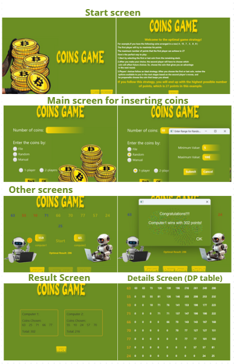

# Coin Game 

This is a simple coin-picking game between **two real players or two computers**, designed using **JavaFX**.
The game uses **Dynamic Programming (DP)** to calculate the best moves for each player.

---

## Features
- Computers take turns automatically.
- Scores update after each turn.
- Calculates the best possible score for each player using DP.
- Shows a **DP table** to explain the best strategy for every coin subset.
- Results window shows:
  - Coins picked by each player.
  - Total score of each player.
- Buttons:
  - **Restart** → play again.
  - **Result** → show player results.
  - **Details** → show DP table.
- Buttons change style when hovered.

---

## How to Play
1. Enter the number of coins, their values, and choose the game type (two or one).
2. The coins appear on the screen.
3. The computers collect coins from both sides.
4. The results are updated automatically.
5. When all coins are drawn, a message appears:
- Who won, or if it's a tie?
- You can click **Result** or **Details** for more information.

---

## JavaFX Interface

